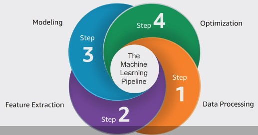
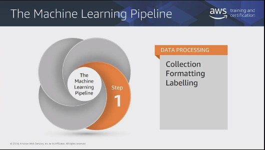
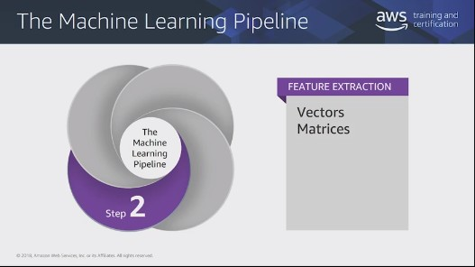
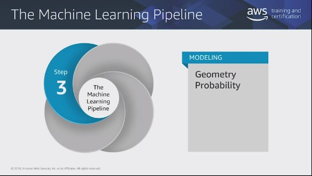
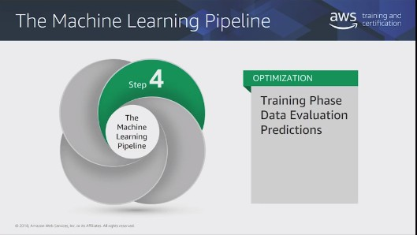
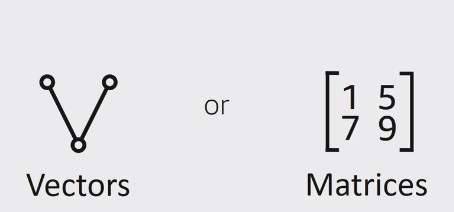

# Machine Learning Pipeline


>### Phase 1: Data Processing
```
    This is where you format data in a way algorithms can ingest. Uses linear algebra.
```


>### Phase 2: Feature Engineering and Selection
```
    This is where you transform data to make it easy for algorithms to understand. Uses vectors and Matrices.
```



>### Phase 3: Modeling
```
    This is where you define the problem in a way the algorithm can optimize. Uses geometry, 
    probability, norms, and statistcs.
```



>### Phase 4: Optimization
```
    This is where you iterate until certain conditions are met, and then you choose the best model. Uses vector calculus.
```



# Mathematics in Context

Data that is represented as either:


